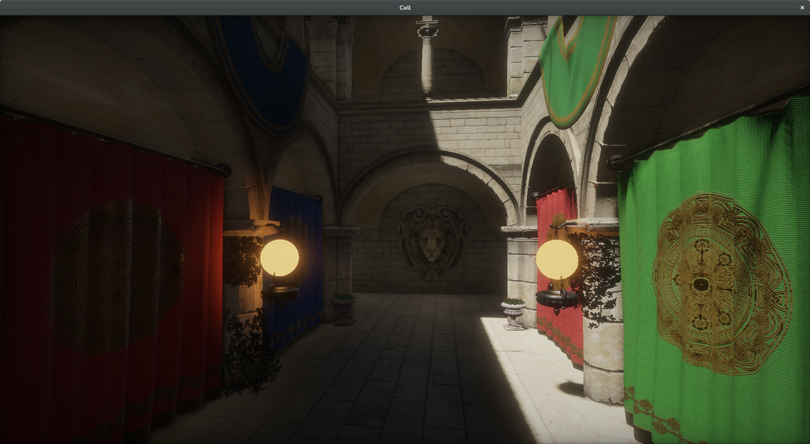

# NOTES

This project is forked from another repository. The purpose of the fork is to build the repo on windows(probably linux later).

[jbehley](https://github.com/jbehley/Cell) updated the repo from [JoeyDeVries](https://github.com/JoeyDeVries/Cell) to use CMake. However, it still does not work for me.

## Build on Windows

With VS 2017:

``` sh
mkdir bbuild
cd bbuild
cmake -G "Visual Studio 15 2017 Win64" ..
cmake --build .
```

Then start `demo.exe` and you should see something like the following image:



# Below is the original README

Cell - Graphics engine
======
Welcome to the development repository of Cell, an open-source OpenGL graphics engine aimed to serve as an educational repository 
for learning how a larger graphics engine can be structured and organized. A large focus of Cell is building an engine that is both easy 
to use and read. Cell also aims to provide both flexible and properly maintainable code. Note that this project is **not** finished, so code may still be vague nor are there proper build files yet.


The engine will be heavily commented and documented from within the source code itself, to motivate new graphics programmers
to take a look at any of its inner workings, without feeling too overwhelming. 


Dependencies
------------
- glfw3

Build
-----
1. Ensure that you also downloaded the submodule, either you used `git clone --recurse-submodules <url>` or update the submodule by `git submodule init` & `git submodule update`.
2. `cd build`
3. `cmake -DCMAKE_BUILD_TYPE=Release ..`
4. `make -j5`
5. run `.\demo`

Feature List (complete:base-functionality)
------
* Fully functioning (custom) math library (vectors, matrices, transformations, utility functions):
	1. Linear algebra: n-dimensional vectors, nxn-dimensional matrices, transformations, utility. 
	2. Trigonemetry: unit circle utility functions, radian/degree conversions.
	3. Utility functions: lerp, step, smoothstep, smootherstep, clamp etc.
    
* Engine utility namespace:
	1. High-precision performance analysis and measurement.
    2. Random numbers.

0. Configure and enable debugging and logging utility.
1. Shader object w/ custom pre-processor (defines, includes):
	1. Include other shader files.
	2. Parse active vertex attributes and uniform variables, retrieve location and store in shader object.
	3. Easy to use state configuration per shader.
    4. Support multiple build paths.
2. Material pipeline; configure render state in materials, together with shader, uniform configuration and samplers used.
	1. Allow for easy access of materials and storage; include set of default materials (default material, glass material etc.)
3. Define Mesh object and encompassing Model class.
	1. Define set of basic shape mesh generation; plane, cube, disk, sphere, cylinder, torus (donut)
    2. Load artist defined 3D models w/ Assimp.
        - Note: Assimp is built as a static library that is statically linked/merged with Cell. I also built the static zlib library for the ingration to work properly with Assimp (both 32 bit).
5. Flexible Framebuffer configuration utility:
	1. Including CubeMap use and generation (reflection probes, point shadow-maps)
	2. Post-processing.
6. Create Render Buffer, draw commands encapsulated in push to render buffer w/ relevant state:
	1. Define list of render push commands (material, mesh)
    2. Collect all render commands and seperate by pass.
    3. Sort render commands per pass; execute (batch where necessary) to minimize state changes.
7. Configure Deferred rendering pipeline:
    1. Configure render buffer w/ geometry pass.
    2. Build fully functional shaders w/ Blinn-Phong (now PBR) lighting.
    3. Normal mapping.
    4. Environment lighting.
	5. Environment reflection support.
    6. Directional shadows
    7. Number of lights optimization.
    8. Per-object motion blur.
8. Functioning PBR render pipeline.
	1. Calculate diffuse integral and store into cubemap.
	2. Prefilter environment map w/ integral and store into cubemap as diffuse integral.
	3. Pre-calculate active BRDF in 2D LUT (approach by Unreal for split sum approximation).
    4. Irradiance reflection probe(s): pre-calculate environment lighting approximation at any scene location.
9. Post-processing
    1. HDR/Gamma/Tone-mapping
    2. Bloom
    3. SSR
    4. Vignette
    5. SSAO 
10. Optimization:
    1. Store material-independent uniforms in UBO; together with barely changing shader parameters.   
	2. Per-object Frustum culling.    
    3. Cache GL state.
11. GUI
    1. IMGUI
		
	
Feature List (work-in-progress)
------
* Engine utility namespace:
    1. Logging.
* Flexible OpenGL initialization.

1. Add Camera functionality; add multiple camera variations: FPS, FlightSim, ArcBall.
2. Configure Deferred rendering pipeline:	
	1. Fog.

Feature List (todo)
------
12. Skeletal animation:
	1. Define Bone structure on top of current scene hierarchy system.
	2. Load skeletal mesh from Assimp as skeletal hierarchy as well? Think of different design solutions that would work well in current environment.
	3. Animation blending.
13. Complete code cleanup (re-factor where relevant), focussing on readability and maintainability. There are still a lot of items that do work, but could be better organized. 
14. Document the entire engine, describing architectural and semantic choices where relevant. Also include a walkthrough guide describing the best file order to start reading/understanding the engine.
15. Configure cross-platform build files (there's currently 0 build support).
